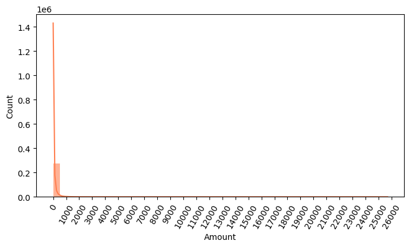

# 신용카드 위조 탐지 분석 보고서

## 1. 분석 목적

 
신용카드 거래 데이터에서 위조(사기) 거래를 탐지하는 분류 모델을 개발하고,  
다양한 전처리 및 모델링 기법을 적용해 재현율과 정밀도 등   
핵심 지표를 개선하는 것이 본 프로젝트의 주요 목표입니다.

---

## 2. 데이터 개요

 
1. 총 데이터 수: 284,807건 
2. 컬럼 수: 31개 (Time, V1~V28, Amount, Class) 
3. Class (타겟): 정상(0) vs 사기(1) 
4. 사기 비율: 약 0.17%로 매우 불균형한 클래스 구성

---

## 3. 데이터 탐색

 
1. Amount 분포 
• 대다수 거래 금액은 매우 작고, 고가 거래는 매우 드물게 존재 
• 로그 변환 필요성이 제기됨 
 

 
2. 상관관계 분석 
• Class(사기 여부)와 가장 음의 상관관계를 보인 피처는 V14, V17 
• 다중공선성은 없으며, 대부분의 피처는 PCA로 변환되어 해석이 어려움 

## 

## 4. 모델링 과정

1. 데이터 분할 시 레이블 분포

- 학습 / 테스트 데이터 모두 사기 비율 약 0.17%로 동일 유지 
- 데이터 불균형 고려하여 재현율 중심의 평가 필요

---

## 5. 기준 모델 성능

 
1. Logistic Regression

| 정확도 | 정밀도 | 재현율 | F1     | AUC    |
| ------ | ------ | ------ | ------ | ------ |
| 0.9992 | 0.8692 | 0.6284 | 0.7294 | 0.8141 |

 
2. LightGBM

| 정확도 | 정밀도 | 재현율 | F1     | AUC    |
| ------ | ------ | ------ | ------ | ------ |
| 0.9995 | 0.9569 | 0.7500 | 0.8409 | 0.8750 |

 
→ LightGBM이 전반적으로 더 우수한 성능을 보임

---

## 6. 정밀도-재현율 트레이드오프

 
1. 특정 threshold 설정에 따라 정밀도와 재현율은 반비례 관계 
2. 운영상 필요한 기준(예: 재현율 우선)을 토대로 적절한 threshold 조정 필요

---

## 7. 추가 전처리 및 개선 실험

 
1. Amount 로그 변환 
• 모델 성능 큰 변화 없음 
• LR 재현율: 0.6014 → 여전히 낮음

 
2. 이상치 제거 (V14 기준) 
• 삭제 인덱스: 8296, 8615, 9035, 9252 
• 성능 개선 관찰됨

 

| 모델 | 재현율 (제거 전 → 후) |
| ---- | --------------------- |
| LR   | 0.6014 → 0.6712       |
| LGBM | 0.7635 → 0.8288       |

 
3. SMOTE 오버샘플링 
• 학습 데이터 수: 199,364 → 398,040 (배수 증폭) 
• 사기 거래 클래스 균형화로 학습 가능성 향상

| 모델 | 정밀도 | 재현율 | F1     | AUC    |
| ---- | ------ | ------ | ------ | ------ |
| LR   | 0.8673 | 0.6712 | 0.7568 | 0.8355 |
| LGBM | 0.9603 | 0.8288 | 0.8897 | 0.9144 |

→ 정밀도와 재현율 모두 개선됨. 특히 LightGBM이 재현율 0.83으로 매우 우수

---

## 8. 결론

 
1. 가장 우수한 성능은 LightGBM + 이상치 제거 + SMOTE 조합에서 나타남 
2. Class imbalance 상황에서는 단순 정확도보다 재현율, AUC, F1 중심의 판단이 중요 
3. 이상치 제거와 오버샘플링을 통해 실제 금융 사기 탐지 시스템에서 요구되는 높은 탐지율을 구현 가능함

---

## 9. 향후 과제

 
1. Threshold 최적화 기반의 경고 시스템 설계 
2. 실거래 적용을 위한 모델 배포 및 실시간 예측 환경 구성 
3. Explainable AI (SHAP 등) 도입을 통한 피처 영향 분석
