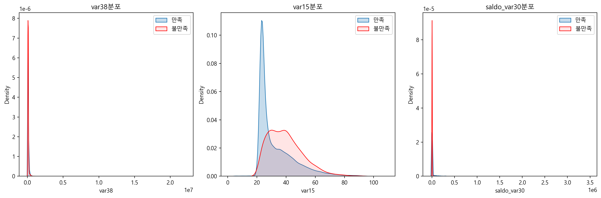

# 1. 프로젝트 개요

## 프로젝트명: Santander 고객 만족도 예측 분석

## 1. 프로젝트 목표

고객의 만족 여부(TARGET)를 예측하고, 불만족 고객의 특성을 도출하여 고객 이탈 방지 전략을 제안한다.

데이터 출처: Kaggle - Santander Customer Satisfaction (https://www.kaggle.com/c/santander-customer-satisfaction)

## 2. 데이터 이해 및 전처리

1. 총 370개 변수, 약 76,000건의 고객 데이터
2. 변수명은 익명 처리되어 있음 (예: var38, saldo_var30 등)

3. TARGET 분포:

- 만족 고객(TARGET=0): 약 96.05%
- 불만족 고객(TARGET=1): 약 3.95% → 불균형 분류 문제

4. 전처리 과정 요약

- 중복값 제거
- 결측치 확인: 없음
- 불균형 대응: AUC 중심 평가, 샘플링 미적용
- 변수별 분포 및 상관관계 분석을 통해 주요 변수 후보군 도출

## 3. 모델링 및 성능 평가

1. **사용 모델: XGBoostClassifier**

- 기본 모델 ROC AUC: 0.8346
- 하이퍼파라미터 튜닝 후 최종 설정
  - n_estimators=1000
  - learning_rate=0.02
  - max_depth=5
  - min_child_weight=3
  - colsample_bytree=0.75
  - reg_alpha=0.03
  - early_stopping_rounds=200
  - _최종 모델 ROC AUC: 0.8394_

2. **주요 변수 중요도**

| 변수명      | 추정 의미                | 해석                                  |
| ----------- | ------------------------ | ------------------------------------- |
| var38       | 고객 잔고 또는 자산 규모 | 수치가 낮을수록 불만족 경향           |
| var15       | 고객 나이                | 연령이 많을수록 불만족 가능성 증가    |
| saldo_var30 | 특정 계좌의 잔액         | 낮은 잔액일수록 불만족 고객 비율 증가 |

## 4. 고객 특성 분석 결과

- 불만족 고객의 평균 잔고(var38)는 만족 고객보다 약 18,000 낮음
- 평균 나이(var15)는 불만족 고객이 약 7세 더 높음
- saldo 계열 변수 및 num 계열 변수에서도 불만족 고객은 상품 이용량과 거래 빈도가 낮은 경향 확인

## 5. 시각적 분포 차이 (KDE plot 기준)

1. `var15`: 만족 고객은 20대 중심, 불만족 고객은 30~40대 이상 비중 증가
2. `var38`, `saldo_var30`: 잔고가 낮은 고객일수록 불만족률이 소폭 증가하는 분포 차이 존재

## 6. 인사이트 및 전략 제안

1. **중장년층 대상 맞춤 전략 필요**

- 나이가 많을수록 불만족 경향이 강함
- 연령대에 맞춘 UI/UX 개선, 안내 콘텐츠 제공 필요

2. **저자산 고객군 관리 강화**

- 잔고가 낮은 고객일수록 불만족률 높음
- 최소 거래 수수료 제도, 소액 자산 혜택 강화 등 리텐션 전략 필요

3. **상품 보유 수 및 거래 빈도 기반 조기 이탈 탐지**

- 상품 사용률이 낮은 고객은 이탈 위험이 높음
- 개인화 마케팅, 추천 시스템, 이벤트 푸시를 통한 활성화 유도

## 7. 결론 및 향후 방향

이번 분석을 통해 고객의 만족 여부는 잔고, 나이, 상품 이용 빈도와 밀접한 관련이 있음을 확인하였다.  
특히 불만족 고객은 나이가 많고, 자산과 이용 빈도가 낮은 경향을 보인다. 이러한 분석 결과를 바탕으로  
고객 이탈 가능성이 높은 군을 사전에 탐지하고, 맞춤형 서비스를 제공하는 전략을 수립할 수 있다.

향후에는 불만족 고객군을 더욱 세분화하는 군집 분석, SHAP 기반 변수 영향력 해석, 텍스트 기반 후기 분석  
등의 확장 분석이 가능할 것이다.
