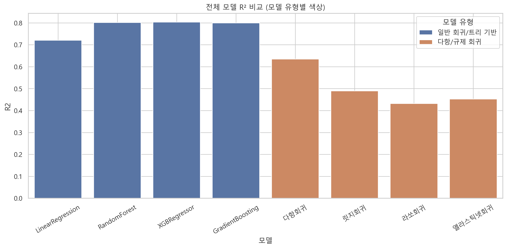
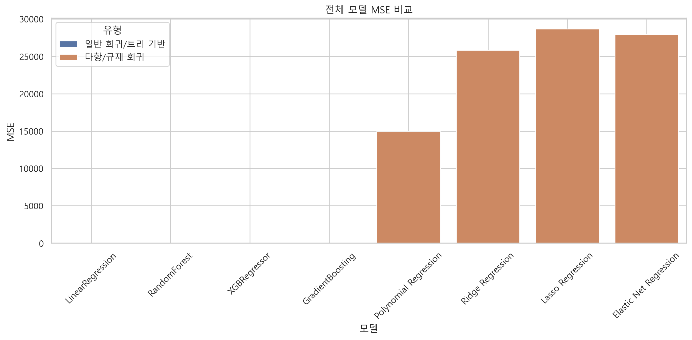
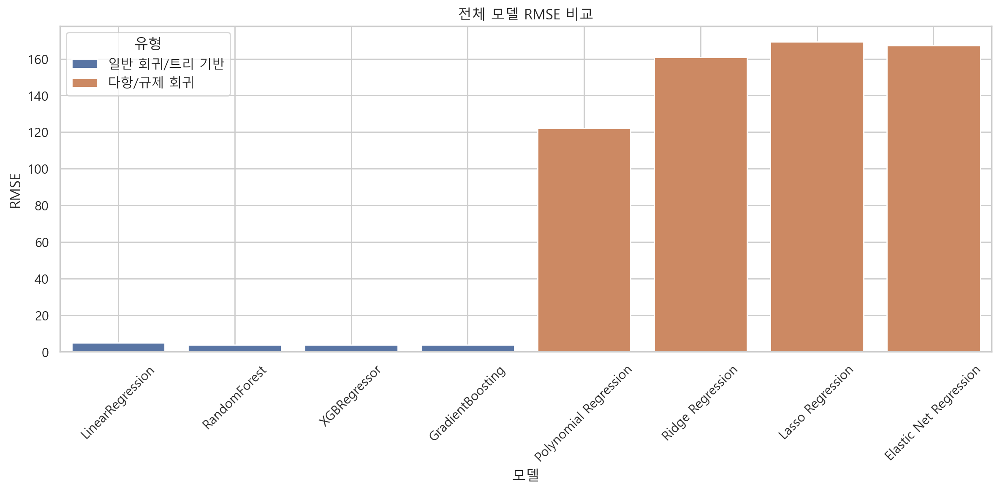

# 자전거 대여 수요 예측 모델 성능 비교 보고서

## 1. 분석 목적

본 분석은 Kaggle의 "Bike Sharing Demand" 데이터를 기반으로, 자전거 대여 수요를  
예측하기 위한 다양한 회귀 모델을 비교하고, 실제 서비스 적용에 적합한 예측 모델을  
도출하는 것을 목표로 한다.

## 2. 데이터 개요

1. 학습 데이터: train.csv (datetime, weather, temperature, humidity 등 포함)
2. 예측 대상: count (자전거 대여량)
3. 전처리 요약:
   1. datetime에서 파생 변수(year, month, hour, dayofweek) 생성
   2. casual, registered 제거
   3. count는 로그 변환 후 학습 (log1p)

## 3. 모델링 전략

1. 적용된 모델 유형

| 분류                | 모델                                                           |
| ------------------- | -------------------------------------------------------------- |
| 일반 회귀/트리 기반 | LinearRegression, RandomForest, XGBRegressor, GradientBoosting |
| 다항 회귀           | Polynomial Regression (degree=2)                               |
| 규제 회귀           | Ridge, Lasso, ElasticNet                                       |

2. 평가 지표
   1. MSE (Mean Squared Error): 예측 오차의 제곱 평균 (작을수록 좋음)
   2. RMSE (Root MSE): MSE의 루트, 해석력 높음
   3. R² (결정계수): 1에 가까울수록 예측력이 높음

## 4. 모델 성능 비교 그래프

### 1. 전체모델R²비교

- R² 값이 1에 가까울수록 예측력이 높음을 의미하며, 예측값이 실제값을 얼마나 잘 설명하는지를 나타낸다.
- XGBRegressor와 RandomForest 모델이 R² 점수가 가장 높게 나타나, 실제 자전거 대여량의 변동을 잘 설명하는 것으로 분석된다.
- 규제 회귀 계열(Lasso, ElasticNet)은 설명력이 다소 낮은 편이며, 단순한 선형 혹은 다항 회귀보다 성능이 떨어지는 경향을 보였다.

### 2. 전체모델mse비교

- 예측값과 실제값 간의 오차 크기를 제곱하여 평균한 값이다.
- 값이 작을수록 예측이 실제에 가까움을 의미한다.
- XGBoost 및 Gradient Boosting 모델은 MSE가 가장 낮아, 예측값이 실제값과 가장 근접한 결과를 보였다.
- 선형 회귀 및 규제 회귀 계열 모델들은 상대적으로 오차가 크며, 실무 적용 시에는 비효율적일 수 있다.

### 3. 전체모델rmse비교

- RMSE(Root Mean Squared Error)는 MSE의 제곱근으로, 실제 단위(자전거 대여량 수치) 기준으로 예측 오차를 해석할 수 있는 지표다.
- 직관적인 오차 크기 비교가 가능하며, 일반적으로 모델 비교에 많이 활용된다.
- RMSE 기준으로도 XGBRegressor가 가장 낮은 값을 보여, 실질적인 예측 오차가 가장 작다.
- 다항회귀와 규제 회귀 모델은 오차 폭이 커서 실제 운영환경에는 부적합할 수 있다.

## 5. 모델 성능 비교

| 유형                 | 모델                   | MSE       | RMSE   | R²     |
| -------------------- | ---------------------- | --------- | ------ | ------ |
| 일반 회귀/트리 기반  | LinearRegression       | 23.42     | 4.84   | 0.7204 |
| 일반 회귀/트리 기반  | RandomForest           | 14.82     | 3.85   | 0.8012 |
| 일반 회귀/트리 기반  | XGBRegressor           | 14.61     | 3.82   | 0.8034 |
| 일반 회귀/트리 기반  | GradientBoosting       | 14.98     | 3.87   | 0.7997 |
| 다항회귀 및 규제회귀 | Polynomial Regression  | 14,926.13 | 122.17 | 0.6349 |
| 다항회귀 및 규제회귀 | Ridge Regression       | 25,837.72 | 160.74 | 0.4901 |
| 다항회귀 및 규제회귀 | Lasso Regression       | 28,688.59 | 169.38 | 0.4318 |
| 다항회귀 및 규제회귀 | Elastic Net Regression | 27,949.44 | 167.18 | 0.4531 |
